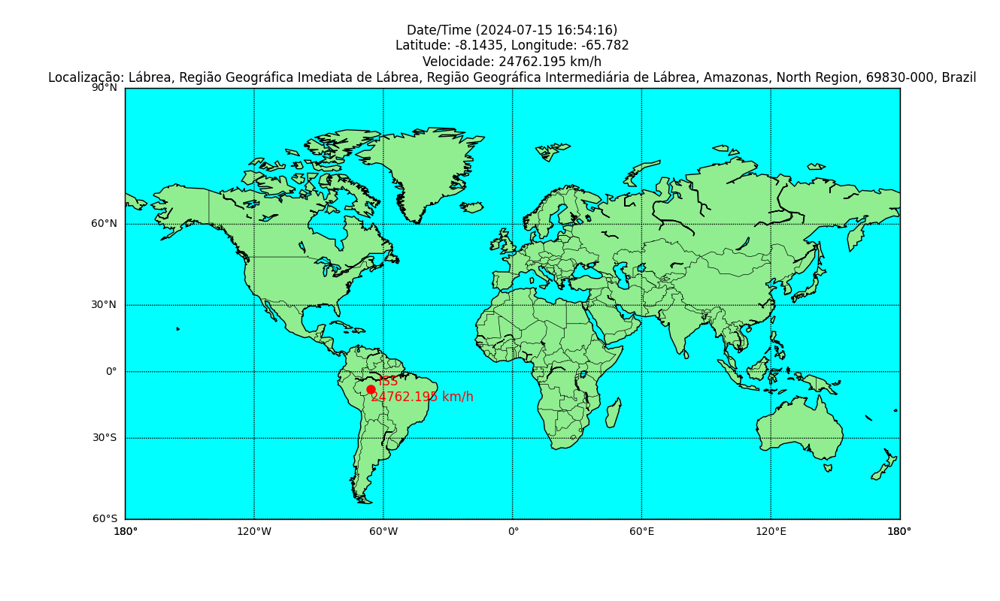

# International Space Station Project

Este projeto em Python fornece informações em tempo real sobre a Estação Espacial Internacional (ISS), incluindo sua localização atual (latitude e longitude). Ele utiliza uma API pública para obter esses dados e apresenta as informações em um mapa.

## Recursos

- **Obtenção de Dados**: O projeto consome a API Open Notify para obter a posição atual da ISS.
- **Cálculo de Velocidade**: Ele calcula a velocidade da ISS entre as atualizações de posição.
- **Plotagem de Mapa**: Ele utiliza a biblioteca Basemap para plotar a localização da ISS em um mapa.

## Amazonas, Região Norte - Brasil



## Instalação

1. **Clone o repositório:**

    ```bash
    git clone https://github.com/Fabricio-colombo/International-Space-Station.git
    cd International-Space-Station
    ```

2. **Crie e ative um ambiente virtual:**

    ```bash
    python3 -m venv venv
    source venv/bin/activate  # Para Linux/Mac
    venv\Scripts\activate  # Para Windows
    ```

3. **Instale as dependências necessárias:**

    ```bash
    pip install -r requirements.txt
    ```

    As seguintes dependências serão instaladas:

    - basemap==1.4.1
    - basemap-data==1.3.2
    - basemap-data-hires==1.3.2
    - certifi==2024.7.4
    - charset-normalizer==3.3.2
    - contourpy==1.2.1
    - cycler==0.12.1
    - fonttools==4.53.1
    - geographiclib==2.0
    - geopy==2.4.1
    - idna==3.7
    - kiwisolver==1.4.5
    - matplotlib==3.8.4
    - numpy==1.26.4
    - packaging==23.2
    - pandas==2.2.2
    - pillow==10.4.0
    - pyparsing==3.1.2
    - pyproj==3.6.1
    - pyshp==2.3.1
    - python-dateutil==2.9.0.post0
    - pytz==2024.1
    - requests==2.32.3
    - six==1.16.0
    - tzdata==2024.1
    - urllib3==2.2.2

